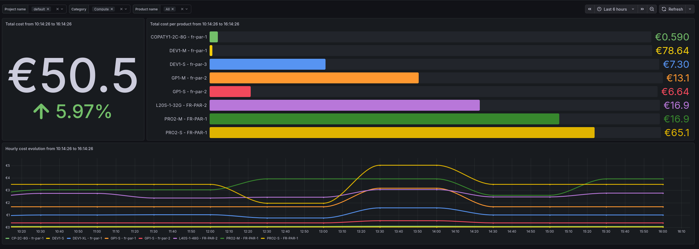

# Scaleway Billing Collector

Python service that snapshots Scaleway Billing API usage, computes deltas from month-to-date values, stores them in SQLite, and exposes Prometheus counters for Grafana.

## Why This Exists

The Scaleway Billing API returns consumption as month-to-date data for a fixed billing period such as `2026-04`. It does not expose arbitrary time-range usage records.

This collector turns those month-to-date snapshots into usable time-series data:

1. Fetch the current Scaleway billing period.
2. Store the raw month-to-date snapshot.
3. Compare it with the previous snapshot for the same billing period and scope.
4. Persist only the computed delta.
5. Expose cumulative Prometheus counters reconstructed from stored live deltas.

Grafana then queries billing evolution over any selected range with PromQL `increase()`.

## Runtime Architecture

```text
Scaleway Billing API
        |
        v
scaleway-billing-collector
        |
        +-- SQLite PVC: raw snapshots and live daily deltas
        |
        +-- /metrics
              |
              v
        Prometheus
              |
              v
          Thanos
              |
              v
          Grafana
```

The Kubernetes deployment is a single long-running pod:

- the main container optionally collects once on start, then collects on a fixed interval;
- `/metrics` is scraped by Prometheus;
- SQLite is stored on a persistent volume;
- one replica is required because SQLite is single-writer.

## Codebase Structure

The app is organized with one dependency direction. Dependencies point inward:

```text
infrastructure -> application -> domain
```

`domain` does not import application or infrastructure code. `application` owns use cases and ports. `infrastructure` implements the ports for Scaleway, SQLite, HTTP, scheduling, and Prometheus. `app.py` is the composition root that wires concrete adapters together.

```text
billing_collector/
  __init__.py
  app.py                         composition root and public application facade
  cli.py                         command-line entry point
  config.py                      environment parsing and immutable settings

  domain/
    classification.py            Scaleway billing taxonomy classifier
    differ.py                    signed delta computation between snapshots
    fingerprints.py              stable row identity for billing lines
    models.py                    billing, tax, project, snapshot, and delta models
    money.py                     Decimal-based money helpers

  application/
    periods.py                   billing-period/date helpers
    ports/
      billing.py                 Scaleway billing client protocol
      repositories.py            persistence and metric-reader protocols
    services/
      billing_collection_service.py       orchestration for billing collection
      collection_models.py                internal collection result DTOs
      consumption_collection_service.py   consumption snapshot collection
      tax_collection_service.py           organization-level tax collection

  infrastructure/
    metrics/
      prometheus_metrics_renderer.py      Prometheus text exposition renderer
    scaleway/
      rest_billing_client.py              Scaleway REST Billing API adapter
    scheduling/
      interval_scheduler.py               fixed-interval scheduler
    sqlite/
      database.py                         schema creation and connections
      converters.py                       SQLite/domain conversion helpers
      daily_delta_repository.py           live billing deltas
      project_repository.py               cached project names
      snapshot_repository.py              raw billing snapshots and lines
      tax_delta_repository.py             live tax deltas
      tax_snapshot_repository.py          raw tax snapshots
    web/
      metrics_server.py                   health, readiness, and metrics HTTP server
```

Top-level files and folders:

```text
Dockerfile                       container image for the collector runtime
deploy/helm/                     Helm chart for Kubernetes deployment
deploy/kubernetes/               Plain Kubernetes fallback manifests
docs/grafana-promql.md           extra PromQL examples
docs/runbook.md                  operational notes
tests/                           unittest suite with mocked Scaleway responses
```

## Collection Model

Daily live collection does this:

1. Determine the current billing period, for example `2026-05`.
2. Fetch current month-to-date consumption from Scaleway.
3. Store the raw snapshot and its billing rows.
4. Load the previous stored snapshot for the same scope and billing period.
5. Compute `current month-to-date amount - previous month-to-date amount`.
6. Store the signed delta for the collection day.
7. Render cumulative Prometheus counters from stored live deltas.

Positive deltas are exported as cost counters. Negative deltas are exported as credit counters. This keeps all Prometheus series monotonic, so Grafana can safely use `increase()`.

The first snapshot for a billing period is a baseline and does not produce a delta. The first useful live delta appears after the second snapshot for the same billing period and scope.

## HTTP Endpoints

The service exposes a small HTTP API on `BILLING_COLLECTOR_BIND_HOST:BILLING_COLLECTOR_BIND_PORT`.

```text
GET /healthz   200 text/plain; charset=utf-8                 ok
GET /readyz    200 text/plain; charset=utf-8                 ready
GET /metrics   200 text/plain; version=0.0.4; charset=utf-8  Prometheus metrics
other paths    404 text/plain; charset=utf-8                 not found
```

Examples:

```bash
curl http://localhost:9503/healthz
curl http://localhost:9503/readyz
curl http://localhost:9503/metrics
```

There is currently no JSON stats API. Grafana should query Prometheus for live time-series values.

## Prometheus Metrics

The collector stores signed deltas internally but exposes cumulative counters.

Do not use `sum_over_time()` on these metrics for billing totals. Prometheus scrapes the same counter value many times between daily collections, so `sum_over_time()` would overcount. Use `increase()` over the Grafana-selected range.

Metrics:

```text
scaleway_billing_cost_euros_total
scaleway_billing_credit_euros_total
scaleway_billing_resource_usage_euros_total
scaleway_billing_subscription_euros_total
scaleway_billing_contract_euros_total
scaleway_billing_free_tier_marker_euros_total
scaleway_billing_billed_quantity_total
scaleway_billing_tax_euros_total
scaleway_billing_tax_credit_euros_total
```

Billing metric labels:

```text
project_id
project_name
consumer_id
category_name
product_name
resource_name
sku
unit
currency
billing_line_type
billing_usage_type
burn_rate_eligible
```

Billing taxonomy labels are derived from Scaleway billing metadata:

```text
billing_line_type=resource_usage|subscription|contract|credit|free_tier_marker|unknown
billing_usage_type=runtime|capacity|request|token|monthly|plan|monetary|currency|unknown
burn_rate_eligible=true|false
```

`billing_line_type` separates real resource usage from commercial lines such as `Subscription`/Gold support and `Contracts`/acceleration agreements. `billing_usage_type` describes the billed unit family. `burn_rate_eligible="true"` is intentionally strict and only applies to runtime units: `minute`, `node_minute`, `ip_minute`, and `hour`.

Tax metric labels:

```text
organization_id
description
currency
rate
```

Tax metrics are organization-level. The tested Scaleway tax endpoint accepts `billing-period` and `organization-id`, but not `project-id` or `category-name`, so the collector does not claim exact project-level tax-included values.

## Grafana Queries



Create Grafana dashboard variables from Prometheus labels:

```promql
label_values(scaleway_billing_cost_euros_total, project_name)
label_values(scaleway_billing_cost_euros_total, category_name)
label_values(scaleway_billing_cost_euros_total, product_name)
label_values(scaleway_billing_cost_euros_total, sku)
label_values(scaleway_billing_cost_euros_total, billing_line_type)
label_values(scaleway_billing_cost_euros_total, billing_usage_type)
```

Set each variable to support multi-value and include-all. In panel queries, use regex matchers such as `project_name=~"$project"` and `category_name=~"$category"`.

Selected-range net cost for a Stat panel:

```promql
sum(increase(scaleway_billing_cost_euros_total{project_name=~"$project",category_name=~"$category"}[$__range]))
-
sum(increase(scaleway_billing_credit_euros_total{project_name=~"$project",category_name=~"$category"}[$__range]))
```

Daily cost evolution for a Time series or Bar chart panel:

```promql
sum by (project_name) (
  increase(scaleway_billing_cost_euros_total{project_name=~"$project",category_name=~"$category"}[1d])
)
-
sum by (project_name) (
  increase(scaleway_billing_credit_euros_total{project_name=~"$project",category_name=~"$category"}[1d])
)
```

For the daily panel, set the panel interval or minimum step to `1d`. The collector updates once per day by default, so smaller steps usually add visual noise without adding billing precision.

Category breakdown over the selected range:

```promql
sum by (category_name) (
  increase(scaleway_billing_cost_euros_total{project_name=~"$project"}[$__range])
)
-
sum by (category_name) (
  increase(scaleway_billing_credit_euros_total{project_name=~"$project"}[$__range])
)
```

Runtime hourly burn rate. This excludes monthly plans, contracts, storage capacity units, request/token usage, and free-tier markers:

```promql
sum(rate(
  scaleway_billing_resource_usage_euros_total{burn_rate_eligible="true"}[1h]
)) * 3600
```

Commercial line split over the selected range:

```promql
sum by (billing_line_type) (
  increase(scaleway_billing_cost_euros_total{project_name=~"$project"}[$__range])
)
```

Resource-only cost over the selected range:

```promql
sum(increase(
  scaleway_billing_cost_euros_total{project_name=~"$project",billing_line_type="resource_usage"}[$__range]
))
```

Product or SKU breakdown:

```promql
sum by (product_name, sku) (
  increase(scaleway_billing_cost_euros_total{project_name=~"$project",category_name=~"$category"}[$__range])
)
-
sum by (product_name, sku) (
  increase(scaleway_billing_credit_euros_total{project_name=~"$project",category_name=~"$category"}[$__range])
)
```

Billed quantity:

```promql
sum by (product_name, sku, unit) (
  increase(scaleway_billing_billed_quantity_total{project_name=~"$project"}[$__range])
)
```

Net tax over the selected range:

```promql
sum(increase(scaleway_billing_tax_euros_total[$__range]))
-
sum(increase(scaleway_billing_tax_credit_euros_total[$__range]))
```

Gross cost over the selected range:

```promql
(
  sum(increase(scaleway_billing_cost_euros_total{project_name=~"$project",category_name=~"$category"}[$__range]))
  -
  sum(increase(scaleway_billing_credit_euros_total{project_name=~"$project",category_name=~"$category"}[$__range]))
)
+
(
  sum(increase(scaleway_billing_tax_euros_total[$__range]))
  -
  sum(increase(scaleway_billing_tax_credit_euros_total[$__range]))
)
```

More examples are available in [docs/grafana-promql.md](docs/grafana-promql.md).

## Prometheus Setup

The Kubernetes manifest exposes port `9503` under the Service port name `metrics` and includes a Prometheus Operator `ServiceMonitor`:

```yaml
apiVersion: monitoring.coreos.com/v1
kind: ServiceMonitor
metadata:
  name: scaleway-billing-collector
  namespace: monitoring
  labels:
    app: scaleway-billing-collector
    release: kube-prometheus-stack
spec:
  namespaceSelector:
    matchNames:
      - monitoring
  selector:
    matchLabels:
      app: scaleway-billing-collector
  endpoints:
    - port: metrics
      path: /metrics
      interval: 60s
```

The `release: kube-prometheus-stack` label must match the selector used by your Prometheus Operator installation. Change it if your Prometheus stack watches a different label.

For a Prometheus setup without the Operator, use a scrape config like this:

```yaml
scrape_configs:
  - job_name: scaleway-billing-collector
    metrics_path: /metrics
    scrape_interval: 60s
    static_configs:
      - targets:
          - scaleway-billing-collector.monitoring.svc.cluster.local:9503
```

A `60s` scrape interval is fine even though billing collection runs daily by default. Prometheus needs regular samples of the cumulative counters; the counter value will remain stable between successful collections.

## Configuration

Required environment variables:

```text
SCW_SECRET_KEY
SCW_ORGANIZATION_ID
```

Optional environment variables:

```text
SCW_API_URL=https://api.scaleway.com
BILLING_COLLECTOR_DATABASE_PATH=/data/billing-collector.sqlite3
BILLING_COLLECTOR_BIND_HOST=0.0.0.0
BILLING_COLLECTOR_BIND_PORT=9503
BILLING_COLLECTOR_PROJECT_IDS=
BILLING_COLLECTOR_CATEGORY_NAMES=
BILLING_COLLECTOR_PREVIOUS_PERIOD_BACKFILL_DAYS=7
BILLING_COLLECTOR_COLLECTION_INTERVAL_SECONDS=3600
BILLING_COLLECTOR_COLLECT_ON_START=true
```

`BILLING_COLLECTOR_PROJECT_IDS` and `BILLING_COLLECTOR_CATEGORY_NAMES` are comma-separated lists. Empty means all projects/categories returned by the Scaleway Billing API.

`BILLING_COLLECTOR_PREVIOUS_PERIOD_BACKFILL_DAYS` controls how long after a new month starts the collector also checks the previous billing period for late corrections.

## Local Usage

Install the package in a virtual environment:

```bash
python -m venv .venv
. .venv/bin/activate
pip install -e .
```

Collect once:

```bash
SCW_SECRET_KEY=... \
SCW_ORGANIZATION_ID=... \
BILLING_COLLECTOR_DATABASE_PATH=./billing-collector.sqlite3 \
billing-collector collect-once
```

Serve metrics:

```bash
SCW_SECRET_KEY=... \
SCW_ORGANIZATION_ID=... \
BILLING_COLLECTOR_DATABASE_PATH=./billing-collector.sqlite3 \
billing-collector serve
```

## Docker

Build the image:

```bash
docker build -t scaleway-billing-collector .
```

Run the server locally:

```bash
docker run --rm \
  -p 9503:9503 \
  -v "$PWD/data:/data" \
  -e SCW_SECRET_KEY=... \
  -e SCW_ORGANIZATION_ID=... \
  scaleway-billing-collector
```

## Published Artifacts

GitHub Actions publishes runtime artifacts on pushes to `main`, version tags such as `v0.1.0`, and manual workflow runs.

Docker image:

```text
ghcr.io/armeldemarsac92/scaleway_billing_collector
```

Helm chart OCI registry:

```text
oci://ghcr.io/armeldemarsac92/charts/scaleway-billing-collector
```

The workflow also uploads the packaged chart `.tgz` as a GitHub Actions artifact.

## Kubernetes With Helm

Create the secret:

```bash
kubectl -n monitoring create secret generic scaleway-billing-collector \
  --from-literal=SCW_SECRET_KEY='<scaleway-secret-key>' \
  --from-literal=SCW_ORGANIZATION_ID='<organization-id>'
```

Install or upgrade the Helm release:

```bash
helm upgrade --install scaleway-billing-collector deploy/helm/scaleway-billing-collector \
  --namespace monitoring \
  --create-namespace
```

Install from the published OCI chart:

```bash
helm upgrade --install scaleway-billing-collector \
  oci://ghcr.io/armeldemarsac92/charts/scaleway-billing-collector \
  --namespace monitoring \
  --create-namespace
```

The chart deploys:

- `ConfigMap` with collector settings;
- `PersistentVolumeClaim` mounted at `/data`;
- `Deployment` with one collector container;
- `Service` exposing named port `metrics` on `9503`;
- `ServiceMonitor` scraping `/metrics` every `60s`.

The pod security context runs as UID/GID `1000`, drops Linux capabilities, disables privilege escalation, uses a read-only root filesystem, and mounts an `emptyDir` at `/tmp`.

The chart defaults to `replicaCount: 1` and a `Recreate` deployment strategy because SQLite is single-writer. See [deploy/helm/scaleway-billing-collector/README.md](deploy/helm/scaleway-billing-collector/README.md) for chart values and [deploy/kubernetes/README.md](deploy/kubernetes/README.md) for the plain manifest fallback.

## Tests

The test suite uses the Python standard library `unittest` plus mocked HTTP responses.

```bash
python -m unittest discover -s tests -p 'test_*.py'
```

## Repository Docs

Operational docs:

- [Kubernetes deployment](deploy/kubernetes/README.md)
- [Helm chart](deploy/helm/scaleway-billing-collector/README.md)
- [Runbook](docs/runbook.md)
- [Grafana PromQL](docs/grafana-promql.md)
- [Implementation plan](BILLING_COLLECTOR_PLAN.md)
